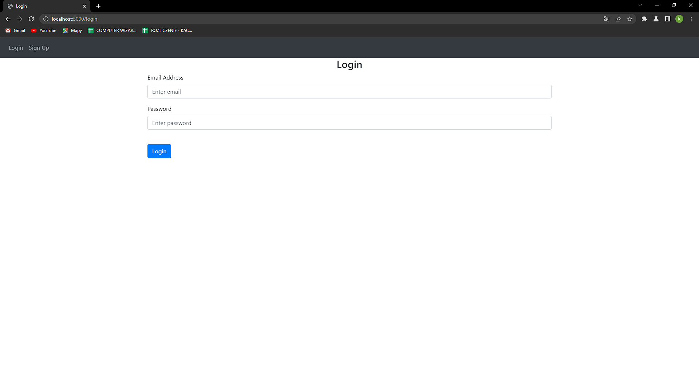

# Flask

Wykorzystując przykłady, dokumentację oraz Internet auto napisał aplikację, która posiada 4 główne widoki. Główny znajduje się pod adresem "/", wyświetlający książki przechowywane w bazie danych. Umożliwia on również dodawanie książek zalogowanemu użytkownikowi. Endpoint jest zablokowany dla niezalogowanych użytkowników.

```python
@views.route('/', methods=['GET', 'POST'])  
@login_required  
def home():  
    if request.method == 'POST':  
        book = request.form.get('book')  
  
        if len(book) < 1:  
            flash('Book is too short!', category='error')  
        else:  
            new_book = Book(data=book, user_id=current_user.id)  
            db.session.add(new_book)  
            db.session.commit()  
            flash('Book added!', category='success')  
  
    return render_template("home.html", user=current_user)
```

Możliwość wylogowania się została zaimplementowana tutaj:

```python
@auth.route('/logout')  
@login_required  
def logout():  
    logout_user()  
    return redirect(url_for('auth.login'))
```



